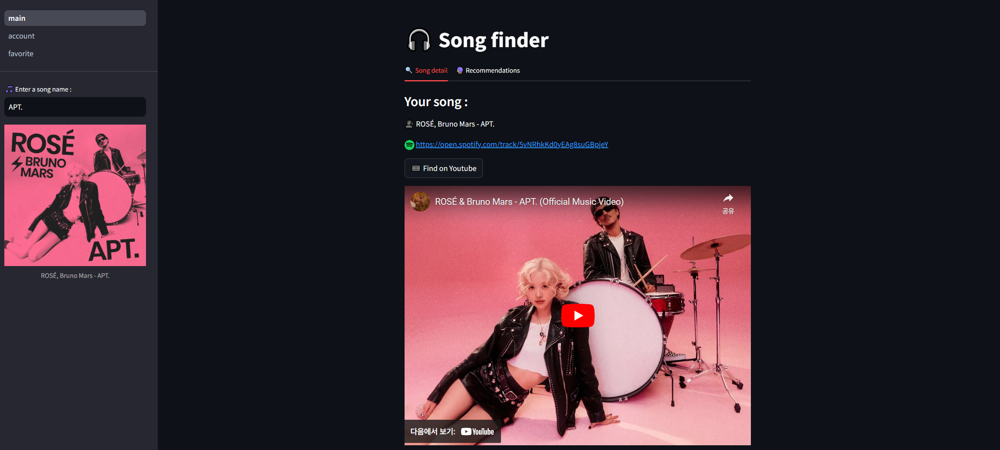
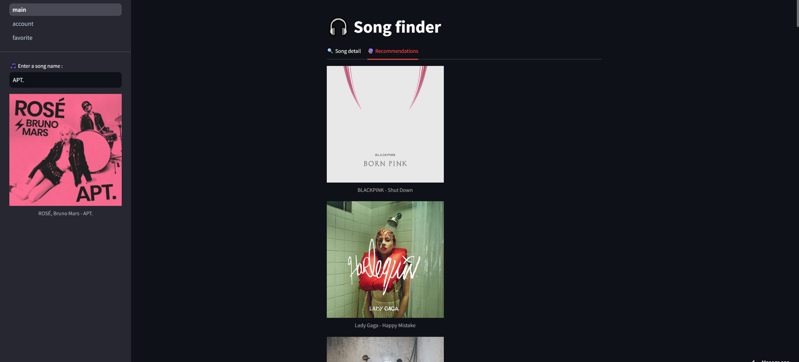
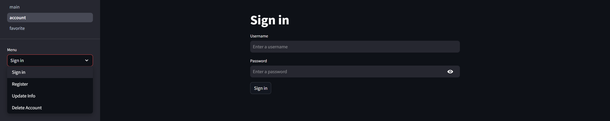
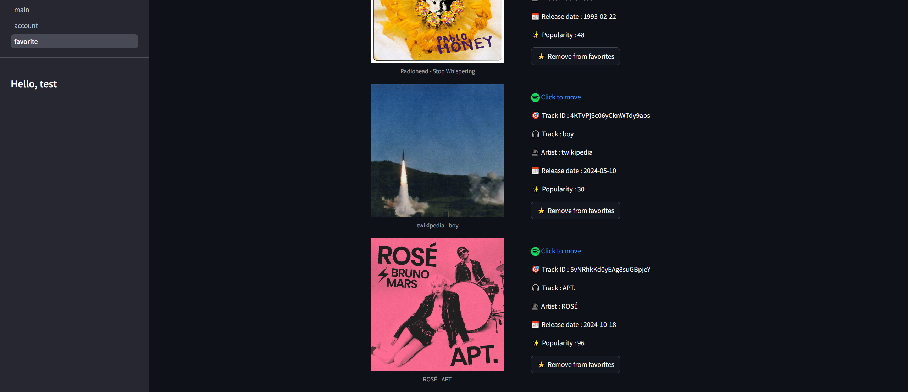

# Song Finder🎵[](https://song-finder.streamlit.app/)


<br/>

**목차:**
1. [노래 검색](#search)
2. [노래 특징 분석](#taste)
3. [노래 추천](#reco)
4. [사용자 계정 관리](#account)
5. [즐겨찾기](#fav)
<br/>

## 1. <a name="search"></a>노래 검색


```python
        with song_detail:
            st.subheader("Your song :")
            st.write(f"🗣️ {track_artists} - {track['name']}")
            url = "https://open.spotify.com/track/"+str(track['id'])
            st.markdown(' '+url,unsafe_allow_html=True)
            yt = st.button('🎞️ Find on Youtube')
            
            if yt:
                try:
                    videos_search = VideosSearch(f"{track['name']} - {track_artists}", limit=1)
                    result = videos_search.result()
                    video_url = result['result'][0]['link']
                    st.video(video_url)
                except:
                    st.write('Did not find the track on Youtube')
```
  
왼쪽 사이드바에 위치한 검색창을 통해 원하는 노래를 검색할 수 있습니다. 검색 결과로는 노래의 상세 정보와 함께 스포티파이로 이동할 수 있는 링크가 제공되며, 유튜브 영상을 바로 재생할 수 있는 버튼도 함께 표시됩니다.  
<br/>
## 2. <a name="taste"></a>노래 특징 분석


```python
            if ft:     
                track_features = sp.audio_features([track['id']])
                features = spotifyAPI.parse_features(track_features)
                
                st.write(features)
                labels= list(features)[:]
                stats= features.mean().tolist()

                angles=np.linspace(0, 2*np.pi, len(labels), endpoint=False)

                stats=np.concatenate((stats,[stats[0]]))
                angles=np.concatenate((angles,[angles[0]]))

                fig=plt.figure(figsize = (18,18), facecolor='none')
                ax = fig.add_subplot(221, polar=True)
                ax.plot(angles, stats, 'o-', linewidth=2, label = "Features", color= '#778899')
                ax.fill(angles, stats, alpha=0.25, facecolor='#778899')
                ax.set_thetagrids(angles[0:7] * 180/np.pi, labels , fontsize = 13, color='gray')
                ax.set_rlabel_position(250)
                ax.patch.set_facecolor('none')
                plt.yticks([0.2 , 0.4 , 0.6 , 0.8  ], ["0.2",'0.4', "0.6", "0.8"], color="gray", size=12)
                plt.ylim(0,1)
                leg = plt.legend(loc='best', bbox_to_anchor=(0.1, 0.1), edgecolor='gray', facecolor='none')
                for text in leg.get_texts():
                    text.set_color('gray')

                st.pyplot(fig)
```

노래가 검색되면 해당 곡의 특징을 자세히 분석한 정보를 확인할 수 있습니다. acousticness, danceability, energy, instrumentalness, liveness, speechiness, valence 의 다양한 음악적 특성이 표와 레이더 차트를 통해 시각적으로 표현됩니다.  
<br/>
## 3. <a name="reco"></a>노래 추천


```python
        with Recommendations:
            for i, track in enumerate(recommendations):
                st.image(track['album']['images'][0]['url'], caption=f"{track['artists'][0]['name']} - {track['name']}", width=300)
    except:
        st.error("429 Client Error: Too Many Requests")
```

검색한 노래와 음악적 특성이 유사한 다른 곡들을 자동으로 추천받을 수 있습니다.  
<br/>
## 4. <a name="account"></a>사용자 계정 관리



로그인과 회원가입이 가능합니다. 사용자는 자신의 계정 정보를 업데이트하거나 필요한 경우 계정을 삭제할 수도 있습니다. 로그인을 완료하면 로그인/회원가입 버튼은 사라지고, 대신 사이드바에 "Hello, (사용자이름)"이 표시됩니다.  
<br/>
## 5. <a name="fav"></a>즐겨찾기


```python
    songid_list = [song[0] for song in favorite_songs]
        
    if songid_list:
        tracks = sp.tracks(songid_list)
        for track in tracks['tracks']:
            col1, col2 = st.columns(2)
            songid = track['id']
            with col1:
                st.image(track['album']['images'][0]['url'], caption=f"{track['artists'][0]['name']} - {track['name']}", width=300)
            with col2:
                st.write('')
                url = "https://open.spotify.com/track/"+str(track['id'])
                st.markdown(f'<a href="{url}"> Click to move</a>',unsafe_allow_html=True)
                st.write(f"🎯 Track ID : {songid}")
                st.write(f"🎧 Track : {track['name']}")
                st.write(f"🗣️ Artist : {track['artists'][0]['name']}")
                st.write(f"📅 Release date : {track['album']['release_date']}")
                st.write(f"✨ Popularity : {track['popularity']}")
                if st.button(f"⭐ Remove from favorites", key=songid):
                    cursor.execute("DELETE FROM favorite WHERE userid = ? AND songid = ?", (userid, songid))
                    conn.commit()  # 데이터베이스에 변경사항 저장
                    st.success(f"Removed {track['name']} from your favorites!")
    else:
        st.info("You haven't added any songs to your favorites yet")
```

로그인을 하면 즐겨찾기를 이용할수 있습니다. 노래를 검색하면 사이드바에 'Add to Favorite' 버튼이 나타나며, 이를 통해 마음에 드는 곡을 즐겨찾기에 추가할 수 있습니다. 즐겨찾기 페이지에서는 추가한 곡들의 트랙명, 아티스트, 발매일, 인기도 정보를 확인할 수 있으며, 'Remove from Favorite' 버튼을 통해 즐겨찾기에서 제거할 수 있습니다.  
<br/>
