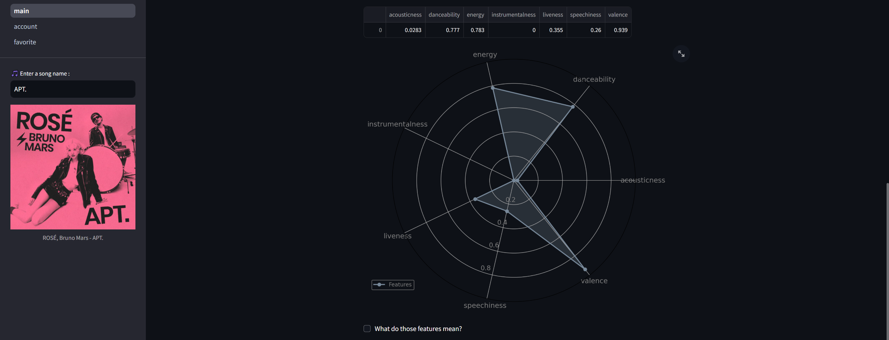

# Song Finder

**목차:**
1. [노래 검색](#search)
2. [노래 특징 분석](#taste)
3. [노래 추천](#reco)
4. [사용자 계정 관리](#account)
5. [즐겨찾기](#fav)

## 1. 노래 검색

  
왼쪽 사이드바에 위치한 검색창을 통해 원하는 노래를 검색할 수 있습니다. 검색 결과로는 노래의 상세 정보와 함께 스포티파이로 이동할 수 있는 링크가 제공되며, 유튜브 영상을 바로 재생할 수 있는 버튼도 함께 표시됩니다.  
 
## 2. 노래 특징 분석

노래가 검색되면 해당 곡의 특징을 자세히 분석한 정보를 확인할 수 있습니다. acousticness, danceability, energy, instrumentalness, liveness, speechiness, valence 의 다양한 음악적 특성이 표와 레이더 차트를 통해 시각적으로 표현됩니다.  
 
## 3. 노래 추천

검색한 노래와 음악적 특성이 유사한 다른 곡들을 자동으로 추천받을 수 있습니다.  
 
## 4. 사용자 계정 관리

로그인과 회원가입이 가능합니다. 사용자는 자신의 계정 정보를 업데이트하거나 필요한 경우 계정을 삭제할 수도 있습니다. 로그인을 완료하면 로그인/회원가입 버튼은 사라지고, 대신 사이드바에 "Hello, (사용자이름)"이 표시됩니다.  
 
## 5. 즐겨찾기

로그인을 하면 즐겨찾기를 이용할수 있습니다. 노래를 검색하면 사이드바에 'Add to Favorite' 버튼이 나타나며, 이를 통해 마음에 드는 곡을 즐겨찾기에 추가할 수 있습니다. 즐겨찾기 페이지에서는 추가한 곡들의 트랙명, 아티스트, 발매일, 인기도 정보를 확인할 수 있으며, 'Remove from Favorite' 버튼을 통해 즐겨찾기에서 제거할 수 있습니다.  
 
